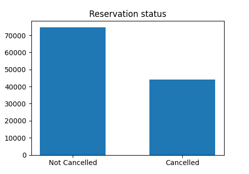
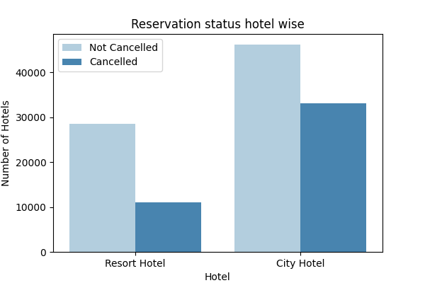
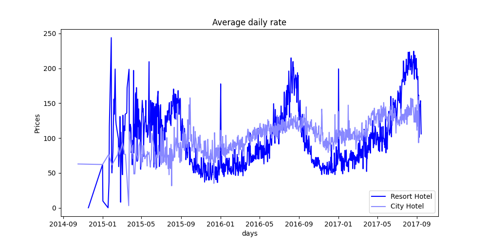
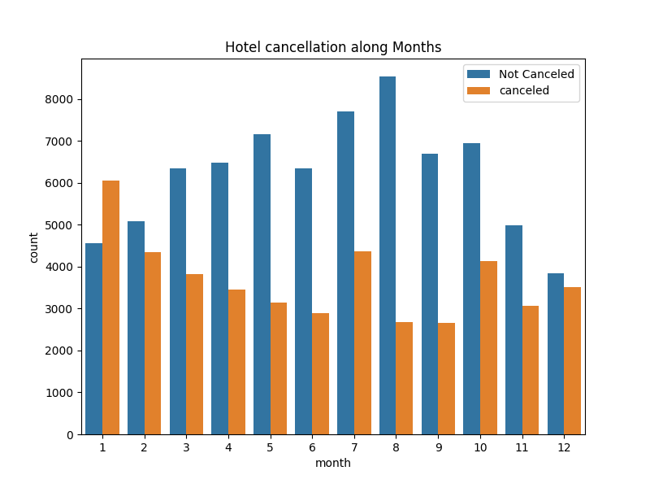
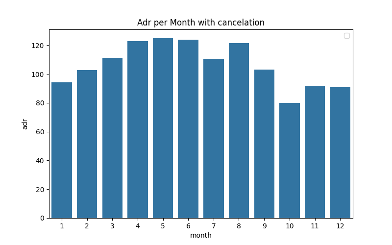
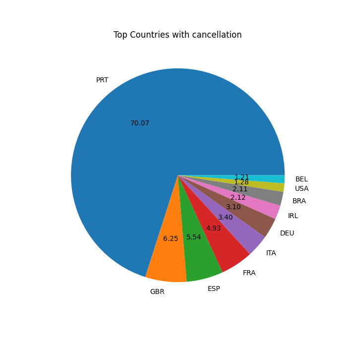
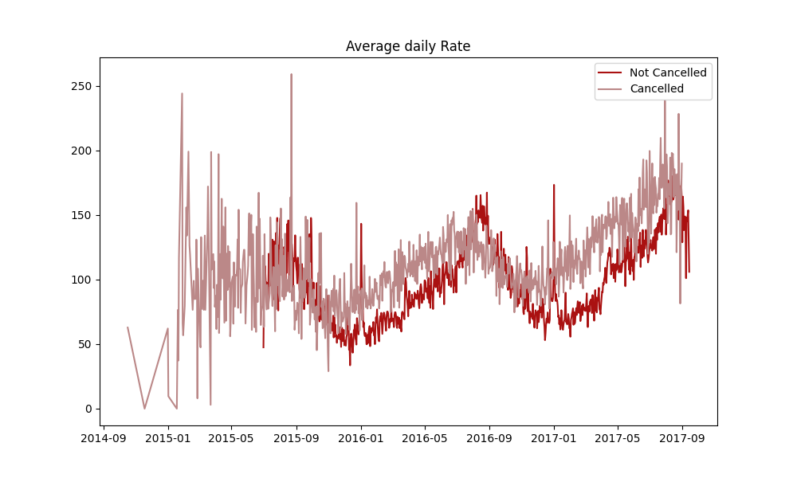

# Hotel Cancelation Business Problem

## Problem Statement 
In recent years, City Hotel and Resort Hotel seen cancellation rates. Each hotel is now dealin with a number of issues as a result, including fewer revenues and less than ideal hotel room use. Consequently, lowering cancellation rates is both hotels primary goal in order to increase their efficiency in generating revenue, and for us to offer thorough advice to address this problem.

<!--  -->

## Assumption
There are Some assumption made while working with this dataset for solving the given problem.

1. Data is from 2015 to 2017 will be considered for analysing the result. 
1. This would be consider and could be proposing hotel's plan as efficient manner.
1. Hotels are not hosting any guests in the rooms that are cancelled.
1. There are no negative effect form the solution.
1. The main factor affecting the business is the cancellation.
1. Extream outliares are not taken in account

## Research Questions 
1. What are the variables that affects hotel reservation cancellation?
2. How can we make the Hotel Reservation Better?
3. How will hotel be assisted in making price and promotional decision?

## Hypothesis 
1. More cancellaion occur when the prices are high.
1. When there is a longer waiting list, customers tends to cancel more frequently.
1. The Majority of clients are comming from offline travel agents to make their reservations.

## Analysis and Findings

    

The accompanying bar graph shows the percentage of reservations that are cancelled and those that are not. It is obvious that there are still a significant number of reservations that have not bee canceled. There are still **37%**  of cilents who canceled their bookings, which has a significant impacat of hotel's earnings.

    

In comparasion to Resort Hotels, City Hotels have more bookings. It's possible that reosrt hotels are more expensive than those in cities of Hotels.

    

In Line graph above show that, on certain days, the **Average Daily Rate** for a city hotel is less than that of a Resort Hotel, and on other days it is even less. It goes without saying that weekends and holidays may see a raise in resort hotel rates. 

    

We have developed the grouped to analyse the month with the heighest and lowest reservation levels according to reservation status.
As We can see, both the number of confirmed reservations and the number of reservations got cancled are largest in month of ***August*** where as in ***January*** is the month with most canceled reservations.

    

This bar graph demonstarate that the cancellation are most common when prices are gratest, and are least common when they are lowest.
Therefore, the cost of accomodation is sorely responsible for the cancellation. 
_There are some issues with the chart and need more research for the conclusion_

Now, Lets see which country has the highest reservation cancellation. 
The top Country is **Portugal** with the heighest cancellation.

    

Let's check the area from where the guests are making the reservations. Is it commming from direct or Groups, Online, or from the Offline Agents? Around 46% of the clients are comming from online travel agencies, whereas 27% come from groups. Only 4% clients books hotel directly by visiting them and making reservations.

    

As seen in the graph, reservations are cancelled when the average daily rate is higher when it is not cancelled. It clearly proves all the above analysis, that the higher price leads to higher cancellation.

## Suggestions
1. Cancellation rates rises as the prices does. In order to prevent cancellation of the reservations, Hotels could work on their pricing stratgies and try to lower the rates for specific hotels based on location. They can also provide some discount to the customers.
2. As the ratio of cancellation to not cancellation is higher in Resort Hotel than city hotels. So Resort Hotels should provide a resonable discount on the rooms prices on weekends or on holidays. 
_I personally don't agree with the Suggestion_
3. In the month of *January*, hotels can start campaigns or marketing with a resonable amount to increase their revanue as the cancellation is the heighest in this month.
4. They can also increase the quality of their Hotels and their services mainly in Portugal to reduce the cacellation retes.